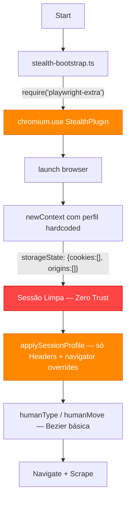
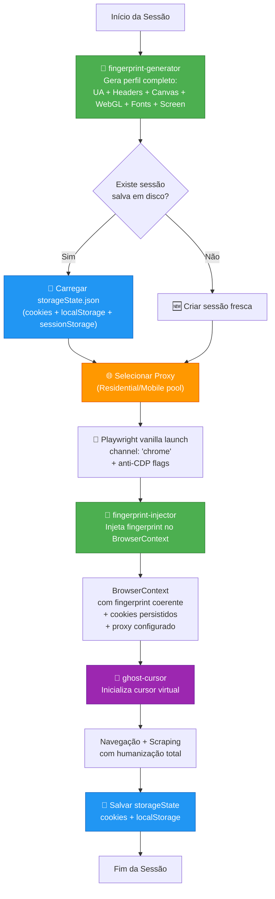

# SPEC: Ultimate Stealth Bypass — Reformulação Completa do Sistema Anti-Bot

**Versão:** 2.0.0
**Data:** 2026-02-19
**Status:** Plano Mestre — LLM-READY
**Autor:** Lead Architect (Plan Mode)

---

## 0. Sumário Executivo

Este documento especifica a **reformulação completa** do sistema anti-bot do `insta_scrap`. O plano migra de uma arquitetura frágil (perfis hardcoded + `puppeteer-extra-plugin-stealth` ultrapassado) para uma stack moderna baseada em **fingerprints gerados dinamicamente** (`fingerprint-generator` + `fingerprint-injector`), **movimentos de mouse hiper-realistas** (`ghost-cursor`), **persistência de sessão** para construir Trust Score, e **rotação nativa de proxies residenciais/mobile**.

O resultado final: um navegador que é **indistinguível de um usuário real** em qualquer superfície de detecção (CDP leaks, Canvas, WebGL, AudioContext, headers, comportamento de mouse/teclado).

---

## 1. Grounding da Codebase Atual

### 1.1 Diagnóstico de Vulnerabilidades

| Arquivo | Vulnerabilidade | Gravidade |
|---------|----------------|-----------|
| `stealth-profile.ts` | 3 perfis UA **hardcoded** — sem rotação de Canvas/WebGL/Audio, sem coerência entre campos | 🔴 Crítica |
| `stealth-bootstrap.ts` | Depende de `puppeteer-extra-plugin-stealth` (abandonado, última atualização significativa em 2022) via `playwright-extra` | 🔴 Crítica |
| `humanization.ts` | Bezier cúbica caseira com easing sine — sem overshoot, sem tremor de mão, sem micro-correções. Padrão detectável por ML | 🟡 Alta |
| `browser-config.ts` | Falta `--disable-blink-features=AutomationControlled`. Usa `--incognito` (reduz trust). Nenhuma flag anti-CDP | 🔴 Crítica |
| `scraper.ts` (Google) | `storageState: { cookies: [], origins: [] }` a cada execução — zero trust score, zero histórico | 🔴 Crítica |
| `scraper.ts` (Instagram) | Sem persistência de sessão, sem proxy, reutiliza contexto do Google | 🟡 Alta |
| `package.json` | `playwright-extra` + `puppeteer-extra-plugin-stealth` como dependências primárias | 🔴 Crítica |

### 1.2 Fluxo Atual (Como Funciona Hoje)



### 1.3 Por que `puppeteer-extra-plugin-stealth` é Insuficiente

O `puppeteer-extra-plugin-stealth` trabalha com **patches estáticos** sobre APIs do navegador. Problemas:

1. **Desatualizado**: Não acompanha as mudanças no Chrome 120+ (ex: `navigator.webdriver` por CDP, `Runtime.enable` leak).
2. **Inconsistência de Fingerprint**: Ele mascara APIs individualmente, mas **não garante coerência** entre elas (ex: o WebGL renderer pode não corresponder ao hardware real do User-Agent).
3. **Detecção por ausência**: Sites modernos detectam que a *ausência* de certos sinais (plugins, perms) é sintoma de automação.
4. **Sem Canvas/WebGL noise real**: Apenas oculta, não gera fingerprints plausíveis.

---

## 2. Stack Técnica Proposta

### 2.1 Dependências a Adicionar

| Pacote | Propósito | NPM |
|--------|----------|-----|
| `fingerprint-generator` | Gera fingerprints browser completos e **coerentes** (UA + headers + screen + WebGL + fonts + Canvas hash) baseados em dados estatísticos reais da web | `@aspect/fingerprint-generator` |
| `fingerprint-injector` | Injeta o fingerprint gerado diretamente no BrowserContext do Playwright, substituindo `addInitScript` manual | `@aspect/fingerprint-injector` |
| `ghost-cursor` | Movimentos de mouse hiper-realistas com overshoot, wind physics, tremor de mão, velocidade variável | `ghost-cursor` |

### 2.2 Dependências a Remover

| Pacote | Motivo da Remoção |
|--------|-------------------|
| `playwright-extra` | **Camada desnecessária** quando usamos `fingerprint-injector` diretamente no Playwright vanilla. Elimina complexidade de runtime e bugs de compatibilidade. |
| `puppeteer-extra-plugin-stealth` | **Obsoleto e insuficiente**. Substituído completamente pelo combo `fingerprint-generator` + `fingerprint-injector`. |

### 2.3 Chain-of-Thought: Validação da Combinação Fingerprint + Playwright Vanilla

> **Pergunta**: A combinação de `fingerprint-injector` + Playwright Vanilla resolve os vazamentos do CDP que o `puppeteer-extra-plugin-stealth` tenta (e falha) em tapar?

**Raciocínio:**

1. **CDP Leak `navigator.webdriver`**: O Playwright vanilla com `--disable-blink-features=AutomationControlled` + `ignoreDefaultArgs: ['--enable-automation']` já remove o flag. O `fingerprint-injector` reforça via `Object.defineProperty`.

2. **CDP Leak `Runtime.enable`**: O `puppeteer-extra-plugin-stealth` aplica patch somente no nível JS, mas bots avançados detectam via protocolo CDP. O Playwright vanilla com `channel: 'chrome'` (browser real) **não expõe o protocolo CDP** da mesma forma que o Chromium bundled.

3. **CDP Leak `navigator.plugins`**: O `stealth` injeta plugins falsos simples. O `fingerprint-generator` gera um **array completo e realista** de plugins baseado em dados estatísticos de browsers reais, com `MimeType` objects coerentes.

4. **Canvas/WebGL Fingerprint**: O `stealth` apenas tenta ocultar. O `fingerprint-injector` gera **hashes de Canvas únicos mas plausíveis** e injeta **WebGL params completos** (renderer, vendor, extensions, shader precision) que correspondem ao hardware do UA gerado.

5. **Font Enumeration**: O `stealth` não toca em fonts. O `fingerprint-generator` gera uma lista de fonts coerente com o SO do perfil.

> **Conclusão**: ✅ A combinação resolve os vazamentos CDP porque:
> - Playwright vanilla com browser real (`channel: 'chrome'`) não tem `Runtime.enable` leak
> - `fingerprint-injector` fornece mascaramento **coerente** de todas as superfícies, não patches isolados
> - Flags de CLI (`--disable-blink-features=AutomationControlled`) eliminam o leak de `navigator.webdriver` no nível do Blink engine
> - A remoção de `playwright-extra` elimina camadas de proxy que podem, elas mesmas, deixar artefatos detectáveis

---

## 3. Arquitetura Alvo — Fluxo de Dados

### 3.1 Diagrama de Fluxo Completo



### 3.2 Detalhamento dos Fluxos

#### A. Geração de Fingerprint Dinâmico (a cada sessão)

```
┌─────────────────────────────────────────────────────────────────┐
│ fingerprint-generator.getFingerprint({                         │
│   browsers: ['chrome'],                                        │
│   operatingSystems: ['windows'],                                │
│   devices: ['desktop'],                                        │
│   locales: ['pt-BR'],                                          │
│   screen: { minWidth: 1366 }                                   │
│ })                                                              │
│                                                                 │
│ OUTPUT:                                                         │
│ ┌──────────────────────────────────────────────────────────┐    │
│ │ fingerprint.navigator.userAgent     → Chrome 133 Win10  │    │
│ │ fingerprint.navigator.platform      → Win32             │    │
│ │ fingerprint.navigator.hardwareConcurrency → 8           │    │
│ │ fingerprint.navigator.deviceMemory  → 8                 │    │
│ │ fingerprint.navigator.plugins       → [Chrome PDF, ...] │    │
│ │ fingerprint.headers['sec-ch-ua']    → correlacionado    │    │
│ │ fingerprint.headers['accept-lang']  → pt-BR,pt;q=0.9   │    │
│ │ fingerprint.screen.width            → 1920              │    │
│ │ fingerprint.screen.height           → 1080              │    │
│ │ fingerprint.videoCard.vendor        → Google Inc.       │    │
│ │ fingerprint.videoCard.renderer      → ANGLE (...)       │    │
│ │ fingerprint.fonts                   → [Arial, ...]      │    │
│ │ fingerprint.canvas (hash seed)      → unique/session    │    │
│ └──────────────────────────────────────────────────────────┘    │
│                                                                 │
│ ✅ COERÊNCIA INTERNA GARANTIDA PELO GENERATOR                  │
│    (UA ↔ headers ↔ screen ↔ GPU ↔ fonts ↔ platform)            │
└─────────────────────────────────────────────────────────────────┘
```

**Diferença vs. atual**: Hoje, `stealth-profile.ts` define apenas `userAgent`, `secChUa`, `platform`, `locale`, `hardwareConcurrency` de forma hardcoded — sem Canvas, sem WebGL, sem fonts, sem `deviceMemory`, sem plugins. O `fingerprint-generator` produz **+40 campos coerentes entre si**.

#### B. Persistência de Sessão (Trust Score)

```
┌─────────────────────────────────────────────────────────────────┐
│ CICLO DE VIDA DA SESSÃO                                         │
│                                                                 │
│ Execução 1:                                                     │
│   → Cria sessão fresca (sem cookies)                            │
│   → Navega, Google seta cookies (NID, 1P_JAR, CONSENT, etc)    │
│   → Instagram seta cookies (csrftoken, mid, ig_did, etc)       │
│   → AO FINALIZAR: context.storageState() → salva em disco      │
│                                                                 │
│ Execução 2:                                                     │
│   → Carrega storageState.json do disco                          │
│   → Browser já "conhece" o usuário → Trust Score elevado        │
│   → Menos CAPTCHAs, menos "suspicious activity"                 │
│   → AO FINALIZAR: atualiza storageState.json                    │
│                                                                 │
│ Execução N:                                                     │
│   → Sessão madura, cookies de consent já aceitos                │
│   → Navegação fluida como usuário recorrente                    │
│                                                                 │
│ ARMAZENAMENTO:                                                  │
│   data/sessions/                                                │
│     ├── google-session.json    (storageState do Google)          │
│     ├── instagram-session.json (storageState do Instagram)      │
│     └── fingerprint-cache.json (último fingerprint válido)      │
│                                                                 │
│ INVALIDAÇÃO:                                                    │
│   → Se cookie expirou → regenerar sessão                        │
│   → Se fingerprint mudou → limpar sessions (consistência)       │
│   → TTL máximo configurável (default: 7 dias)                   │
└─────────────────────────────────────────────────────────────────┘
```

#### C. Rotação de Proxies (Residential/Mobile)

```
┌─────────────────────────────────────────────────────────────────┐
│ PROXY CONFIGURATION (Opcional, ativado via config)              │
│                                                                 │
│ Interface:                                                      │
│ {                                                               │
│   proxy: {                                                      │
│     enabled: true,                                              │
│     provider: 'custom' | 'brightdata' | 'smartproxy',          │
│     type: 'residential' | 'mobile' | 'datacenter',             │
│     server: 'http://proxy.example.com:PORT',                    │
│     username: 'user',                                           │
│     password: 'pass',                                           │
│     rotationStrategy: 'per-session' | 'per-request',           │
│     geoTarget: 'BR'                                             │
│   }                                                             │
│ }                                                               │
│                                                                 │
│ INTEGRAÇÃO COM PLAYWRIGHT:                                      │
│   browser.newContext({                                           │
│     proxy: {                                                    │
│       server: config.proxy.server,                              │
│       username: config.proxy.username,                          │
│       password: config.proxy.password                           │
│     }                                                           │
│   })                                                            │
│                                                                 │
│ COERÊNCIA:                                                      │
│   → Se proxy BR → fingerprint locale MUST ser pt-BR            │
│   → Se proxy US → fingerprint locale MUST ser en-US            │
│   → Timezone MUST corresponder à geo do proxy                   │
└─────────────────────────────────────────────────────────────────┘
```

---

## 4. Mudanças por Arquivo

### 4.1 `stealth-profile.ts` → Refatoração Total

**Estado atual**: 3 perfis `UserAgentProfile` hardcoded com apenas 8 campos.

**Estado alvo**: Substituir por wrapper do `fingerprint-generator`.

```diff
- const USER_AGENT_PROFILES: UserAgentProfile[] = [
-   { userAgent: '...Chrome/133...', secChUa: '...', ... },
-   { userAgent: '...Chrome/132...', secChUa: '...', ... },
-   { userAgent: '...Chrome/131...', secChUa: '...', ... }
- ];
-
- export function pickSessionProfile(): UserAgentProfile {
-   const index = Math.floor(Math.random() * USER_AGENT_PROFILES.length);
-   return USER_AGENT_PROFILES[index];
- }
-
- export async function applySessionProfile(context, profile) {
-   await context.setExtraHTTPHeaders({ ... });
-   await context.addInitScript(({ platform, hardwareConcurrency }) => {
-     Object.defineProperty(navigator, 'platform', { ... });
-     Object.defineProperty(navigator, 'hardwareConcurrency', { ... });
-   }, { ... });
- }

+ import { FingerprintGenerator } from 'fingerprint-generator';
+ import { FingerprintInjector } from 'fingerprint-injector';
+
+ const generator = new FingerprintGenerator({
+   browsers: [{ name: 'chrome', minVersion: 120 }],
+   operatingSystems: [{ name: 'windows' }],
+   devices: ['desktop'],
+   locales: ['pt-BR'],
+ });
+
+ export function generateSessionFingerprint() {
+   return generator.getFingerprint();
+ }
+
+ export async function injectFingerprint(context, fingerprint) {
+   const injector = new FingerprintInjector();
+   await injector.attachFingerprintToPlaywright(context, fingerprint);
+ }
```

**Mudanças chave:**
- ❌ Remover array `USER_AGENT_PROFILES` hardcoded
- ❌ Remover `pickSessionProfile()` (seleção aleatória de 3 perfis)
- ❌ Remover `applySessionProfile()` (injection manual de 2 campos)
- ✅ Usar `FingerprintGenerator` para gerar perfis completos e coerentes
- ✅ Usar `FingerprintInjector.attachFingerprintToPlaywright()` para injection automática de **todos** os campos

### 4.2 `humanization.ts` → Integração com `ghost-cursor`

**Estado atual**: Funções `humanMove()` e `humanType()` com bezier cúbica caseira (`cubicBezierPoint`) e easing sine.

**Estado alvo**: Substituir movimentação de mouse por `ghost-cursor`, manter e aprimorar typing.

```diff
- import { Page } from 'playwright';

+ import { Page } from 'playwright';
+ import { createCursor } from 'ghost-cursor-playwright';

  // humanType permanece (já é bom), mas aprimorado:
  // - Adicionar variação gaussiana no delay (não só uniform random)
  // - Adicionar micropausa de "pensamento" antes de começar a digitar
  // - Manter mecanismo de typo + backspace

- export async function humanMove(page: Page, selector: string): Promise<void> {
-   const target = page.locator(selector).first();
-   const box = await target.boundingBox();
-   // ... 35 linhas de bezier caseira ...
-   // Problemas: sem overshoot, sem wind physics, sem tremor
- }

+ export async function createHumanCursor(page: Page) {
+   return createCursor(page, await getRandomStartPosition(page));
+ }
+
+ export async function humanMove(cursor, selector: string): Promise<void> {
+   // ghost-cursor internamente aplica:
+   // ✅ Overshoot com correção (passa do ponto e volta)
+   // ✅ Wind physics (aceleração/desaceleração não-linear)
+   // ✅ Tremor de mão (micro-jitter com frequência humana)
+   // ✅ Velocidade variável baseada na distância
+   // ✅ Micro-pausa antes do click
+   await cursor.click(selector);
+ }
```

**Mudanças chave:**
- ❌ Remover `cubicBezierPoint()` e toda a lógica de bezier caseira
- ❌ Remover `easeInOutSine()`
- ✅ Importar e usar `createCursor` do `ghost-cursor-playwright`
- ✅ Manter `humanType()` existente (com aprimoramentos de variação gaussiana)
- ✅ `humanMove()` passa a ser wrapper fino sobre `ghost-cursor`
- ✅ Adicionar scroll humanizado com `cursor.moveTo()` + `page.mouse.wheel()`

### 4.3 `browser-config.ts` → Flags Avançadas Anti-CDP

**Estado atual**: Flags genéricas, sem proteção contra detecção CDP.

**Estado alvo**: Flags otimizadas para stealth máximo.

```diff
  export const BROWSER_CONFIG: BrowserConfig = {
    channel: 'chrome',
    args: [
      '--start-maximized',
      '--no-sandbox',
      '--disable-setuid-sandbox',
      '--disable-dev-shm-usage',
-     '--disable-accelerated-2d-canvas',
-     '--disable-gpu',
-     '--incognito',
-     '--disable-extensions',
-     '--disable-plugins',
+     // REMOVIDOS: --disable-accelerated-2d-canvas e --disable-gpu
+     //   → Precisamos de Canvas e WebGL ATIVOS para fingerprint
+     // REMOVIDO: --incognito
+     //   → Modo incógnito reduz trust e altera fingerprint
+     // REMOVIDOS: --disable-extensions e --disable-plugins
+     //   → Extensões/plugins fazem parte do fingerprint normal

+     // FLAGS ANTI-CDP (CRÍTICAS)
+     '--disable-blink-features=AutomationControlled',

+     // FLAGS DE STEALTH
+     '--disable-features=IsolateOrigins,site-per-process,TrackingProtection3pcd,ImprovedCookieControls',
+     '--disable-site-isolation-trials',

      '--disable-sync',
      '--no-first-run',
      '--no-default-browser-check',
-     '--disable-features=TrackingProtection3pcd,ImprovedCookieControls',
      '--disable-background-networking',
      '--disable-default-apps',
      '--disable-translate',
      '--disable-notifications',
      '--disable-popup-blocking',
      '--disable-save-password-bubble',
      '--disable-infobars',
      '--disable-breakpad',
      '--disable-component-update',
      '--disable-domain-reliability',
      '--disable-client-side-phishing-detection',
      '--disable-hang-monitor',
      '--metrics-recording-only',
      '--no-pings'
    ],
    viewport: null,
    ignoreDefaultArgs: ['--enable-automation'],
    timeout: 30000
  };
```

**Mudanças chave:**
- ❌ Remover `--disable-accelerated-2d-canvas` (precisamos Canvas ativo)
- ❌ Remover `--disable-gpu` (precisamos WebGL ativo para fingerprint)
- ❌ Remover `--incognito` (reduz trust score, altera fingerprint)
- ❌ Remover `--disable-extensions` e `--disable-plugins` (presença faz parte do perfil normal)
- ✅ Adicionar `--disable-blink-features=AutomationControlled` (**CRITICAL**: remove `navigator.webdriver=true` no Blink)
- ✅ Adicionar `--disable-site-isolation-trials` (reduz artefatos de automação)
- ✅ Manter `ignoreDefaultArgs: ['--enable-automation']` (remove infobar "Chrome is being controlled")

### 4.4 `stealth-bootstrap.ts` → Simplificação Radical

**Estado atual**: Carrega `playwright-extra` e `puppeteer-extra-plugin-stealth` com fallback.

**Estado alvo**: Usar **Playwright vanilla direto** — sem camada extra.

```diff
- import { Browser, chromium as playwrightChromium } from 'playwright';
- import { BROWSER_CONFIG } from '../../engine/browser-config';
-
- let chromiumDriver = null;
- let stealthPluginFactory = null;
- // ... 50 linhas de try/catch para carregar playwright-extra ...
-
- export async function launchStealthBrowser(channel) {
-   ensureStealthPlugin();
-   // ... lógica complexa de fallback playwright-extra -> vanilla ...
- }

+ import { Browser, chromium } from 'playwright';
+ import { BROWSER_CONFIG } from '../../engine/browser-config';
+
+ export async function launchStealthBrowser(channel: string): Promise<Browser> {
+   return chromium.launch({
+     ...BROWSER_CONFIG,
+     channel,
+     headless: false
+   });
+ }
```

**Mudanças chave:**
- ❌ Remover **todo** o código de `playwright-extra` e `puppeteer-extra-plugin-stealth`
- ❌ Remover variáveis globais `chromiumDriver`, `stealthPluginFactory`, `stealthConfigured`, `stealthAvailable`
- ❌ Remover funções `loadStealthRuntime()` e `ensureStealthPlugin()`
- ✅ Reduzir para uma função simples que faz `chromium.launch()` direto
- ✅ Todo o stealth agora vem do `fingerprint-injector` **no contexto**, não no browser

### 4.5 `scraper.ts` (Google) → Sessão Persistente + Proxy

**Estado atual**: Cria contexto com `storageState: { cookies: [], origins: [] }` em toda execução.

**Estado alvo**: Carregar/salvar sessão do disco + suporte a proxy.

```diff
  // Em launchBrowser():

- this.context = await this.browser.newContext({
-   viewport: null,
-   colorScheme: 'light',
-   locale: profile.locale,
-   timezoneId: profile.timezoneId,
-   userAgent: profile.userAgent,
-   storageState: { cookies: [], origins: [] },
-   ignoreHTTPSErrors: true,
-   javaScriptEnabled: true,
-   offline: false
- });
- await applySessionProfile(this.context, profile);

+ const fingerprint = generateSessionFingerprint();
+ const savedState = await loadSessionState('google');
+
+ this.context = await this.browser.newContext({
+   viewport: null,
+   colorScheme: 'light',
+   locale: fingerprint.navigator.language,
+   timezoneId: resolveTimezone(fingerprint),
+   userAgent: fingerprint.navigator.userAgent,
+   storageState: savedState || undefined,
+   ignoreHTTPSErrors: true,
+   javaScriptEnabled: true,
+   offline: false,
+   ...(proxyConfig ? { proxy: proxyConfig } : {})
+ });
+
+ await injectFingerprint(this.context, fingerprint);

  // Em closeBrowser() (NOVO):

+ const state = await this.context.storageState();
+ await saveSessionState('google', state);
```

**Mudanças chave:**
- ❌ Remover import de `applySessionProfile` e `pickSessionProfile`
- ✅ Usar `generateSessionFingerprint()` em vez de `pickSessionProfile()`
- ✅ Usar `injectFingerprint()` em vez de `applySessionProfile()`
- ✅ Carregar `storageState` do disco se existir
- ✅ Salvar `storageState` ao fechar browser
- ✅ Aceitar `proxy` na configuração do contexto
- ✅ Aplicar mesma lógica no `InstagramProfileScraper`

### 4.6 `scraper.ts` (Instagram) → Reutilizar Sessão

O scraper de Instagram já reutiliza o `BrowserContext` do Google (`scrapeProfileInNewTab`). Com as mudanças no contexto, ele automaticamente herda:
- ✅ Fingerprint injetado
- ✅ Cookies persistidos
- ✅ Proxy configurado

Mudança adicional necessária:
- Salvar cookies do Instagram separadamente em `data/sessions/instagram-session.json` caso seja usado em sessão standalone no futuro.

### 4.7 `package.json` → Atualização de Dependências

```diff
  "dependencies": {
    "chalk": "^4.1.2",
-   "chromium-bidi": "^7.3.2",
    "inquirer": "^8.2.7",
    "ora": "^5.4.1",
    "playwright": "^1.30.0",
-   "playwright-extra": "^4.3.6",
-   "puppeteer-extra-plugin-stealth": "^2.11.2"
+   "fingerprint-generator": "^2.1.0",
+   "fingerprint-injector": "^2.1.0",
+   "ghost-cursor-playwright": "^1.0.0"
  }
```

### 4.8 Novo Arquivo: `src/engine/session-manager.ts`

Responsável pela persistência de sessão:

```
SessionManager
├── loadSessionState(platform: 'google' | 'instagram') → StorageState | null
├── saveSessionState(platform, state: StorageState) → void
├── isSessionExpired(platform) → boolean
├── clearSession(platform) → void
└── getSessionPath(platform) → string

Armazenamento: data/sessions/<platform>-session.json
TTL padrão: 7 dias (configurável)
```

### 4.9 Novo Arquivo: `src/engine/proxy-config.ts`

Responsável pela configuração de proxy:

```
ProxyConfig
├── loadProxyConfig() → PlaywrightProxy | null
├── validateProxy(config) → boolean
├── resolveGeoConstraints(proxyGeo, fingerprint) → FingerprintConstraints
```

### 4.10 Atualização: `src/scripts/sannysoft-stealth.ts`

O script de teste precisa usar a nova stack:

```diff
- import { launchStealthBrowser } from '../agents/google-search/stealth-bootstrap';
- import { applySessionProfile, pickSessionProfile } from '../agents/google-search/stealth-profile';

+ import { launchStealthBrowser } from '../agents/google-search/stealth-bootstrap';
+ import { generateSessionFingerprint, injectFingerprint } from '../agents/google-search/stealth-profile';

- const profile = pickSessionProfile();
+ const fingerprint = generateSessionFingerprint();

- await applySessionProfile(context, profile);
+ await injectFingerprint(context, fingerprint);
```

---

## 5. Critérios de Aceitação (RFC 2119)

### 5.1 MUST (Obrigatório — Falha é bloqueante)

| # | Critério | Validação |
|---|----------|-----------|
| M1 | O sistema **MUST** gerar um fingerprint dinâmico e **internamente coerente** a cada sessão usando `fingerprint-generator` | Inspecionar o objeto fingerprint retornado; UA ↔ headers ↔ WebGL ↔ Canvas ↔ fonts devem ser consistentes |
| M2 | O sistema **MUST** injetar o fingerprint no BrowserContext via `fingerprint-injector` (não via `addInitScript` manual) | Verificar que `attachFingerprintToPlaywright()` é chamado antes de qualquer navegação |
| M3 | O sistema **MUST** passar nos testes do `bot.sannysoft.com` sem falhas nos campos: `navigator.webdriver`, `Chrome`,  `Chrome (native)`, `Permissions`, `Plugins Length`, `Languages` | Screenshot do sannysoft com todos os campos verdes |
| M4 | O sistema **MUST** persistir a sessão (cookies + localStorage) entre execuções em arquivo local | Verificar que `data/sessions/*.json` é criado após primeira execução e carregado na segunda |
| M5 | O sistema **MUST** usar `--disable-blink-features=AutomationControlled` nas flags do browser | Inspecionar `BROWSER_CONFIG.args` |
| M6 | O sistema **MUST** NÃO depender de `playwright-extra` nem de `puppeteer-extra-plugin-stealth` | Verificar `package.json` e imports |
| M7 | O sistema **MUST** manter compatibilidade CommonJS (sem ESM) | `npm run build` deve compilar sem erros |
| M8 | O sistema **MUST** usar movimentos de mouse via `ghost-cursor` com overshoot e wind physics | Verificar que `createCursor()` é usado no lugar da bezier caseira |

### 5.2 SHALL (Recomendado Forte — Omissão requer justificativa)

| # | Critério |
|---|----------|
| S1 | O sistema **SHALL** invalidar sessões expiradas automaticamente (TTL configurável) |
| S2 | O sistema **SHALL** gerar fingerprint diferente a cada sessão para evitar tracking cross-session |
| S3 | O sistema **SHALL** manter a funcionalidade de CAPTCHA manual wait existente |
| S4 | O sistema **SHALL** logar o fingerprint gerado (UA, locale, screen) para debug |

### 5.3 SHOULD (Desejável — Melhoria significativa)

| # | Critério |
|---|----------|
| SH1 | O sistema **SHOULD** permitir a injeção de proxy residential/mobile através da configuração |
| SH2 | O sistema **SHOULD** garantir coerência entre geo do proxy e locale/timezone do fingerprint |
| SH3 | O sistema **SHOULD** incluir warm-up navigation (visitar sites neutros antes do alvo) para construir histórico |
| SH4 | O sistema **SHOULD** suportar scroll humanizado com micro-scroll reverso |

### 5.4 MAY (Opcional — Nice-to-have)

| # | Critério |
|---|----------|
| MA1 | O sistema **MAY** suportar pool de proxies com rotação automática |
| MA2 | O sistema **MAY** incluir métricas de humanização (latência média de teclas, distância de mouse) |
| MA3 | O sistema **MAY** suportar headless mode com stealth flags adicionais |

---

## 6. Plano de Implementação (Ordem de Execução)

### Fase 1: Fundação (Dependências + Config)
1. Atualizar `package.json` — remover deps antigas, adicionar novas
2. `npm install`
3. Modificar `browser-config.ts` — flags anti-CDP

### Fase 2: Core Stealth (Fingerprint)
4. Refatorar `stealth-profile.ts` — `fingerprint-generator` + `fingerprint-injector`
5. Simplificar `stealth-bootstrap.ts` — Playwright vanilla
6. Atualizar `sannysoft-stealth.ts` — usar nova stack

### Fase 3: Humanização
7. Integrar `ghost-cursor` em `humanization.ts`
8. Aprimorar `humanType()` com variação gaussiana

### Fase 4: Persistência
9. Criar `session-manager.ts`
10. Modificar `scraper.ts` (Google) — carregar/salvar sessão
11. Modificar `scraper.ts` (Instagram) — sessão persistente

### Fase 5: Proxy (SHOULD)
12. Criar `proxy-config.ts`
13. Integrar proxy no contexto do browser

### Fase 6: Validação
14. Rodar `npm run test:stealth` → screenshot sannysoft
15. Rodar `npm run build` → compilação sem erros
16. Teste funcional: busca Google completa com persistência de sessão

---

## 7. Riscos e Mitigações

| Risco | Probabilidade | Impacto | Mitigação |
|-------|--------------|---------|-----------|
| `fingerprint-generator` não tem build CommonJS | Média | Alto | Verificar se tem exports CJS; se não, usar `esModuleInterop` ou dynamic import wrapper |
| `ghost-cursor` não tem binding oficial para Playwright | Baixa | Médio | Existe `ghost-cursor-playwright` como fork compatível; validar compatibilidade com Playwright 1.30+ |
| Mudança de fingerprint entre sessões invalida cookies | Baixa | Médio | Opção de "fixar" fingerprint enquanto sessão estiver válida (cache em `fingerprint-cache.json`) |
| Playwright channel `chrome` não disponível | Baixa | Baixo | Fallback para `msedge` já existe na codebase |

---

## 8. Árvore de Arquivos Afetados

```
src/
├── agents/
│   ├── google-search/
│   │   ├── stealth-profile.ts      [REFATORAÇÃO TOTAL]
│   │   ├── stealth-bootstrap.ts    [SIMPLIFICAÇÃO]
│   │   ├── humanization.ts         [INTEGRAÇÃO ghost-cursor]
│   │   └── scraper.ts              [SESSÃO + PROXY]
│   └── instagram-profile/
│       └── scraper.ts              [HERDA MUDANÇAS DO CONTEXTO]
├── engine/
│   ├── browser-config.ts           [FLAGS ANTI-CDP]
│   ├── session-manager.ts          [NOVO]
│   └── proxy-config.ts             [NOVO]
├── scripts/
│   └── sannysoft-stealth.ts        [ATUALIZAR IMPORTS]
└── types/
    └── index.ts                    [ADICIONAR INTERFACES]

package.json                        [DEPS ATUALIZADAS]

data/sessions/                      [NOVO DIRETÓRIO — RUNTIME]
├── google-session.json
├── instagram-session.json
└── fingerprint-cache.json
```

---

## 9. Validação Técnica

### 9.1 Teste Stealth (Automatizado)

```bash
npm run test:stealth
```

Executa `sannysoft-stealth.ts` → navega para `bot.sannysoft.com` → captura screenshot.

**Critério de sucesso**: Todos os campos do sannysoft marcados em verde (sem red flags).

### 9.2 Teste de Compilação

```bash
npm run build
```

**Critério de sucesso**: Zero erros de TypeScript.

### 9.3 Teste Funcional (Manual)

```bash
npm run dev:google
```

1. Verificar que o browser abre sem infobar "Chrome is being controlled"
2. Verificar que a busca Google funciona com humanização
3. Verificar que `data/sessions/google-session.json` é criado ao finalizar
4. Executar novamente e verificar que os cookies são carregados (sem consent dialog)

---

*Documento preparado para execução por agente LLM. Cada seção é auto-contida com contexto suficiente para implementação sem ambiguidade.*
